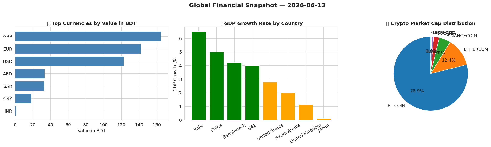
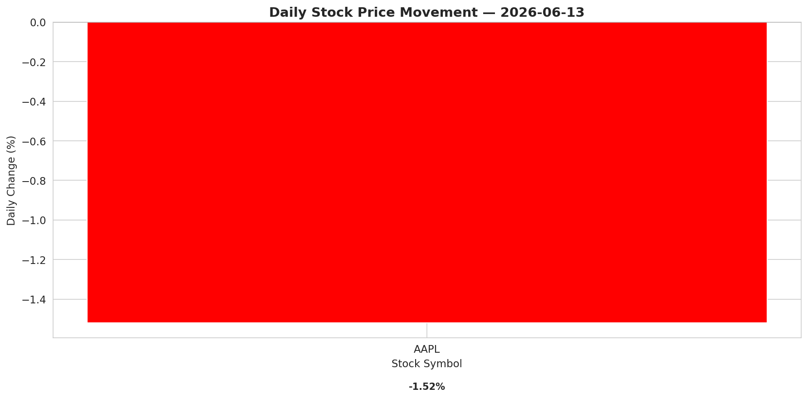
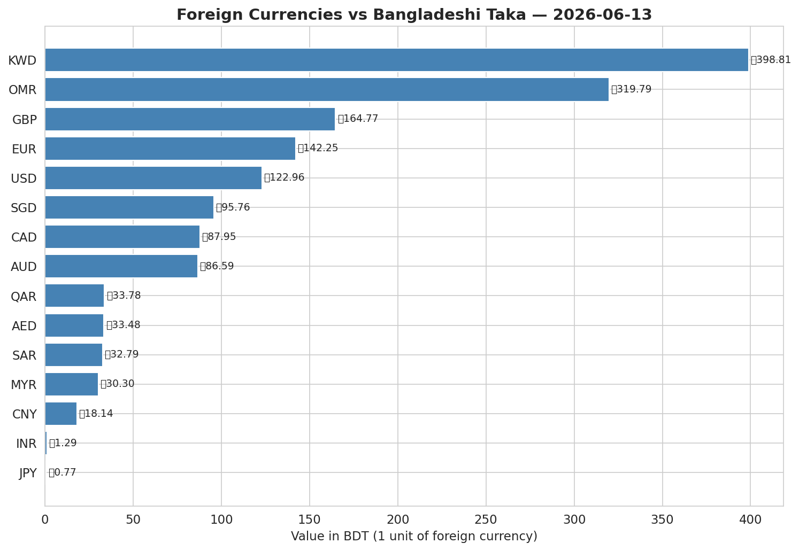
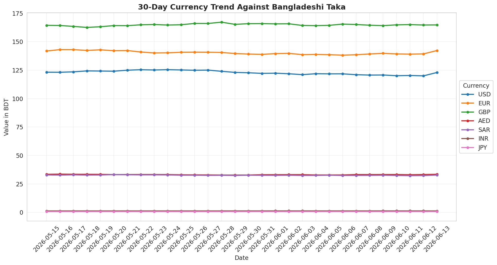
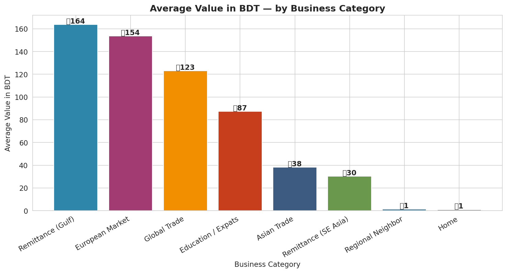

# 🌐 Real-Time Multi-Source Financial Data Integration System

An end-to-end **API-driven data integration pipeline** that ingests live data from **4 independent financial APIs**, performs cross-source enrichment, generates business-ready analytics, and delivers automated reports to Google Sheets.

Built as a demonstration of **modern data engineering patterns** — multi-source API integration, semi-structured data handling, schema reconciliation, secrets management, and automated multi-channel reporting.

---

## 📌 Project Overview

Real-world data pipelines rarely depend on a single source. Companies integrate forex feeds, market data, partner APIs, and macroeconomic indicators into **unified business views**. This project demonstrates that pattern by integrating **four production-style data sources** centered on the Bangladeshi Taka (BDT) as the reporting currency.

**The 4 Integrated Data Sources:**

| # | Source | Data Type | Authentication |
|---|---|---|---|
| 1 | ExchangeRate-API | Foreign exchange rates (160+ currencies) | Public |
| 2 | CoinGecko | Cryptocurrency market data (6 major coins) | Public |
| 3 | World Bank | Macroeconomic indicators (GDP growth) | Public |
| 4 | Alpha Vantage | US stock market quotes (real-time) | API Key (secured via Colab Secrets) |

**Real-world applications of this pattern:**
- Fintech apps aggregating multi-source market data
- Investment dashboards combining stocks, crypto, and forex
- Banking systems pulling correspondent data feeds
- Operations dashboards monitoring multi-vendor service KPIs
- Currency exchanges providing customers a unified financial view

---

## 🔧 Tech Stack

| Layer | Tool |
|---|---|
| Language | Python 3 |
| HTTP / API Client | requests |
| Authentication | Colab Secrets (production-style secrets management) |
| Data Format | Semi-structured JSON (4 different schemas) |
| Data Processing | Pandas, NumPy |
| Visualization | Matplotlib, Seaborn |
| Reporting | OpenPyXL (Excel), gspread (Google Sheets API) |
| Environment | Google Colab |

---

## 🏗️ System Architecture

```
┌─────────────────────────────────────────────────────────┐
│  Source 1: Exchange Rate API   (Public)                 │
│  Source 2: CoinGecko API       (Public)                 │
│  Source 3: World Bank API      (Public)                 │
│  Source 4: Alpha Vantage API   (API Key Required)       │
└─────────────────────────────────────────────────────────┘
                            ↓
              Python Ingestion Layer (requests)
                            ↓
        JSON Parser (4 different nested schemas)
                            ↓
   Enrichment Layer (timestamps, BDT conversion, country mapping)
                            ↓
       Schema Reconciliation (unified ISO codes & currency)
                            ↓
        Analytical Layer (aggregations & business categorization)
                            ↓
            Visualization Layer (Matplotlib)
                            ↓
   Multi-Channel Delivery (Excel + Google Sheets API)
```

### Engineering Patterns Demonstrated

- **Multi-source integration** — Combining 4 independent APIs into a single business view
- **Secrets management** — API keys stored in Colab Secrets, never hardcoded
- **Cross-source enrichment** — Forex rates used to convert crypto and stock prices into BDT
- **Schema reconciliation** — Unifying ISO country codes, currency codes, and JSON shapes
- **Defensive programming** — try/except blocks, request timeouts, rate-limit awareness
- **Audit trail** — every record carries `collected_at` and `api_last_update` for traceability

---

## 📊 Sample Visualizations

### Unified Global Financial Snapshot


### Stock Market Movements


### Currency Rates vs BDT


### 30-Day Currency Trend


### Business Category Comparison


---

## 🗂️ Repository Structure

```
real-time-data-integration-system/
│
├── README.md
├── notebook/
│   └── Currency_Tracker_System.ipynb
├── data/
│   └── currency_rates_latest.csv
├── reports/
│   └── Currency_Report.xlsx
└── charts/
    ├── chart_current_rates.png
    ├── chart_30_day_trend.png
    ├── chart_by_category.png
    ├── chart_global_snapshot.png
    └── chart_stocks.png
```

> The `data/` folder contains a sample output snapshot. In production, the pipeline generates timestamped snapshots daily for historical tracking — these are not committed to the repo to keep it clean.

---

## 🚀 How to Run

1. Clone this repository
2. Get a free Alpha Vantage API key: https://www.alphavantage.co/support/#api-key
3. Open `notebook/Currency_Tracker_System.ipynb` in Google Colab
4. Add your API key to **Colab Secrets** as `ALPHA_VANTAGE_KEY`
5. Run all cells in order
6. Authenticate with Google when prompted (for Sheets export)

---

## 📚 What This Project Demonstrates

- Building **multi-source data integration pipelines** from scratch
- Handling **multiple semi-structured JSON schemas** in production-style code
- Implementing **secure API authentication** with proper secrets management
- Designing **enrichment layers** that add business context to raw data
- Producing **multi-channel automated reports** (Excel + Google Sheets)
- Writing defensive, reusable code suitable for scheduling and reuse
- Documenting engineering decisions for non-technical stakeholders

---

## 🎯 Skills Demonstrated

`Python` `REST APIs` `Multi-Source Integration` `API Authentication` `JSON` `Semi-Structured Data` `Schema Reconciliation` `Pandas` `NumPy` `Time-Series Analysis` `Workflow Automation` `Google Sheets API` `Data Visualization` `Business Intelligence` `Secrets Management` `Defensive Programming`

---

## 👤 Author

**Aisha Islam**
Computer Science | BRAC University
📧 ayasha.islam@g.bracu.ac.bd
🔗 [LinkedIn](https://www.linkedin.com/in/ayashaislam)

---

⭐ If you found this project useful, consider giving it a star!
